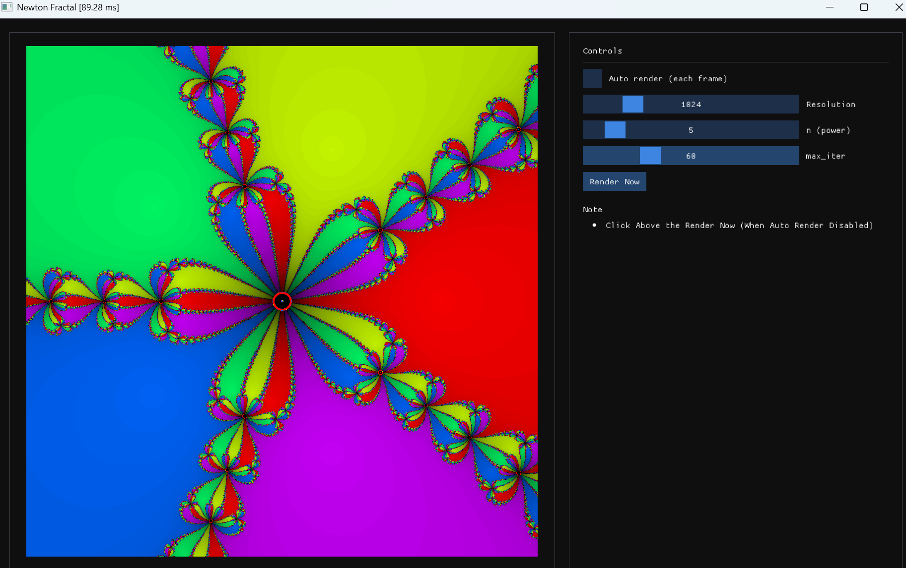

An **Newton Fractal** accelerated with [ISPC (Intel Implicit SPMD Program Compiler)](https://ispc.github.io/).

<p align="center">
  
</p>

---

## Video
<video poster="NewtonFractal.png">
  <source src="https://github.com/user-attachments/assets/a0f5f333-6705-46b4-9b09-4dc3b9a8e2f4" type="video/mp4">
</video>
---

## Features
- Fast fractal rendering using ISPC (SPMD-on-SIMD).
- Adjustable polynomial degree *n* and iteration count.
  
---

## Running the Prebuilt Binary
If you just want to try it out:
1. Download the `NewtonFractal.zip` from the [Releases](../../releases) page.
2. Extract it anywhere.
3. Run `newton.exe`.

**Note**:  
- The provided build is compiled for **modern CPUs with AVX2 support**.  
- On older CPUs without AVX2, you may need to rebuild with a lower ISPC target (change of CMakeLists.txt `sse2-i32x4`).

---

## Building from Source

### Prerequisites
- CMake 3.16+
- C++17 compiler (Visual Studio 2019/2022 on Windows, GCC/Clang on Linux/macOS)
- [ISPC](https://ispc.github.io/downloads.html)


### Build Steps
```bash
# Configure (Release mode)
cmake -S . -B build -DCMAKE_BUILD_TYPE=Release

# Build
cmake --build build --config Release
```
